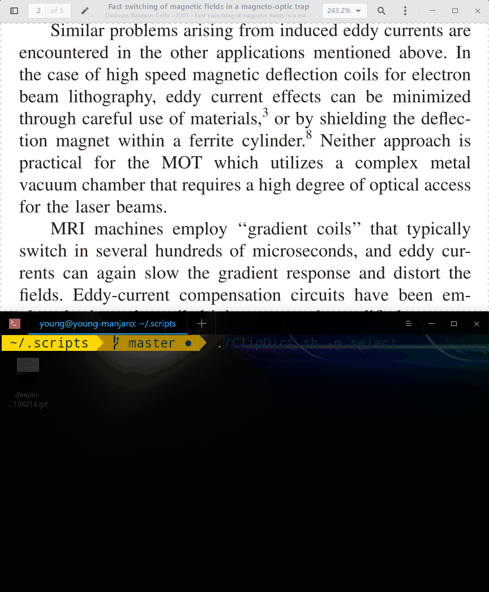

# ClipDict
A command line dictionary -- reading from clipboard. (A simple wrapper of dictd.)

> Why do we need this since Goldendict works pretty well? 

~~Because CLI is cool, cooler, coolest!~~

## Demo


## Pre-requisites

- dictd
- xclip

Tested on Manjaro Linux 18.1.5 (DDE)

## Usage

### Synopsis
    ClipDict.sh [OPTION] [value]

### Options
    -h  show this help text
    -m  set the working MODE:
          copy    translate a word when copied (default)
          select  translate a word upon selected
    -n  display the output in system notifications or terminal
          false  in terminal (default)
          true   in system notifications
    -v  show the version

### Example

```shell
./ClipDict.sh
./ClipDict.sh -m select -n true
./ClipDict.sh -h
```

## References

- Inspired by [CBDict](https://github.com/olixu/CBDict)
- [dictd](https://wiki.archlinux.org/index.php/Dictd):
  - [Install dictd](https://linux.cn/article-2953-1.html) and
  - [local chinese dictionaries](https://www.jianshu.com/p/661c8e5bed86)
